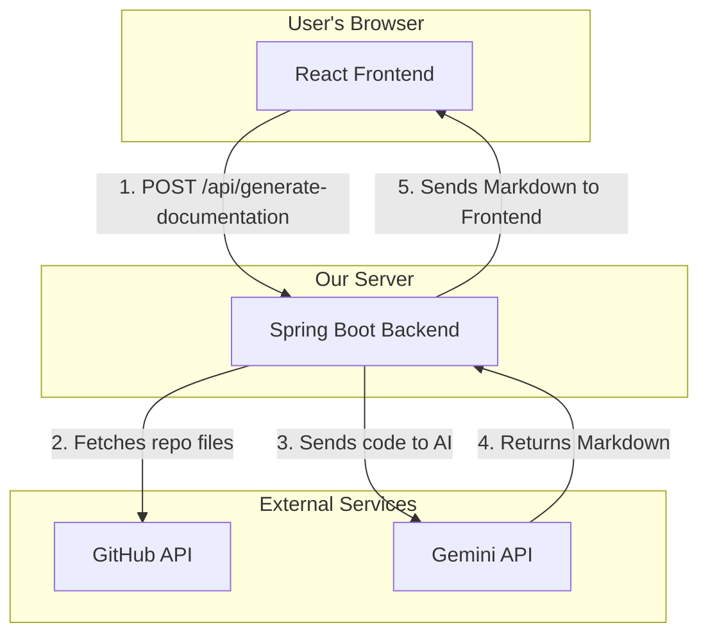

# EasyDocs 📄✨

[![React][React-shield]][React-url]
[![Spring][Spring-shield]][Spring-url]
[![Java][Java-shield]][Java-url]
[![License: MIT][License-shield]][License-url]

Tired of writing documentation? **EasyDocs** is an intelligent, AI-powered application that automatically generates comprehensive and professional `README.md` files for your GitHub repositories. Just provide a URL, and let the AI handle the rest.


## 🌟 Features

* **AI-Powered Generation**: Leverages the Google Gemini API to understand your code and generate human-like documentation.
* **Full-Stack Architecture**: Built with a modern, responsive React frontend and a robust Java Spring Boot backend.
* **Intelligent Content Creation**:
    * Generates a complete project overview, key features, and a detailed module-by-module breakdown.
    * Automatically creates high-level architecture diagrams using **Mermaid.js**.
    * Dynamically includes a "Getting Started" guide with installation steps if it detects a `package.json` file.
* **Modern UI**: A sleek, dark-themed user interface built with Tailwind CSS, featuring a live-rendered preview of the generated Markdown.
* **Copy-to-Clipboard**: Easily copy the generated Markdown, ready to be pasted directly into your GitHub repository's `README.md` file.

## 🛠️ Tech Stack & Architecture

EasyDocs is built with a modern, decoupled frontend and backend architecture.

| Frontend                                 | Backend                             | APIs Used                             |
| ---------------------------------------- | ----------------------------------- | ------------------------------------- |
| ![React][React-shield]                   | ![Spring][Spring-shield]            | ![GitHub][GitHub-shield]              |
| ![Vite][Vite-shield]                     | ![Java][Java-shield]                | ![Gemini][Gemini-shield]              |
| ![Tailwind CSS][Tailwind-shield]         | ![Maven][Maven-shield]              |                                       |

### System Architecture

The application follows a simple, powerful flow: the user interacts with the React frontend, which communicates with the Spring Boot backend via a REST API. The backend then orchestrates calls to the GitHub API (to fetch repository files) and the Gemini API (to generate the documentation).



## 🚀 Getting Started

To get a local copy up and running, follow these simple steps.

### Prerequisites

* Java `21` or higher
* Apache Maven `3.9+`
* Node.js `18+` and `npm`

### Configuration

Before you can run the application, you need to provide your secret API keys to the backend.

1.  Navigate to the `back/src/main/resources/` directory.
2.  Create a new file named `application-secret.properties`.
3.  Add your keys to this file as follows:

    ```properties
    # /back/src/main/resources/application-secret.properties

    gemini.api.key=YOUR_GOOGLE_GEMINI_API_KEY
    github.api.token=YOUR_GITHUB_PERSONAL_ACCESS_TOKEN
    ```

    *The `github.api.token` only needs `public_repo` scope.*

### Installation & Running

1.  **Clone the repository:**
    ```bash
    git clone [https://github.com/mitali-dxt/EasyDocs.git](https://github.com/mitali-dxt/EasyDocs.git)
    cd EasyDocs
    ```

2.  **Run the Backend Server:**
    Open a terminal in the `back/` directory and run:
    ```bash
    mvn spring-boot:run
    ```
    The backend will start on `http://localhost:8080`.

3.  **Run the Frontend Application:**
    Open a second terminal in the `Front/` directory and run:
    ```bash
    # Install dependencies
    npm install

    # Start the development server
    npm run dev
    ```
    The frontend will be available at `http://localhost:5173`.

## 🛣️ Future Improvements

EasyDocs is a powerful proof-of-concept with many exciting possibilities for expansion:

* [ ] **Support for Private Repositories**: Implement a "Login with GitHub" feature using OAuth2 to allow users to document their private projects.
* [ ] **Real-time Streaming**: For large repositories, use WebSockets to stream the generated documentation back to the user in real-time.
* [ ] **Advanced Code Analysis**: Pre-process the source code to extract class/function signatures for more targeted and accurate documentation.
* [ ] **Caching**: Implement a caching layer to avoid re-generating documentation for repositories that have already been processed.

## Licensing

Distributed under the MIT License. See `LICENSE` for more information.

---
[React-shield]: https://img.shields.io/badge/React-20232A?style=for-the-badge&logo=react&logoColor=61DAFB
[React-url]: https://reactjs.org/
[Spring-shield]: https://img.shields.io/badge/Spring-6DB33F?style=for-the-badge&logo=spring&logoColor=white
[Spring-url]: https://spring.io/
[Java-shield]: https://img.shields.io/badge/Java-ED8B00?style=for-the-badge&logo=openjdk&logoColor=white
[Java-url]: https://www.java.com/
[Vite-shield]: https://img.shields.io/badge/Vite-646CFF?style=for-the-badge&logo=vite&logoColor=white
[Vite-url]: https://vitejs.dev/
[Tailwind-shield]: https://img.shields.io/badge/Tailwind_CSS-38B2AC?style=for-the-badge&logo=tailwind-css&logoColor=white
[Tailwind-url]: https://tailwindcss.com/
[Maven-shield]: https://img.shields.io/badge/Maven-C71A36?style=for-the-badge&logo=apache-maven&logoColor=white
[Maven-url]: https://maven.apache.org/
[GitHub-shield]: https://img.shields.io/badge/GitHub-100000?style=for-the-badge&logo=github&logoColor=white
[GitHub-url]: https://docs.github.com/en/rest
[Gemini-shield]: https://img.shields.io/badge/Gemini_API-4285F4?style=for-the-badge&logo=google&logoColor=white
[Gemini-url]: https://ai.google.dev/
[License-shield]: https://img.shields.io/badge/License-MIT-yellow.svg
[License-url]: https://opensource.org/licenses/MIT
